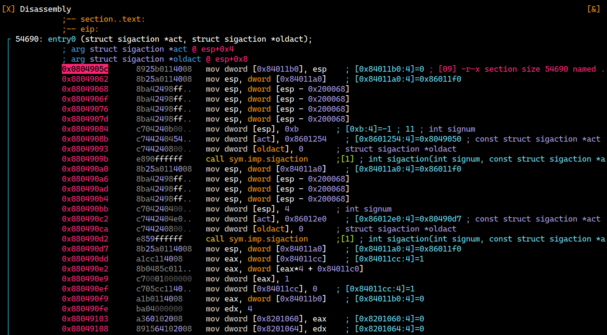

# Walkthrough

This file contains the walkthrough for the challenge `Free Drinks`.

This challenge requires the participants to analyze the program and find out how to bypass the authentication and have the program to decrypt the flag. The original logic for this challenge is relatively simple, but is made far more sophisticated by compiling the program with [movfuscator](https://github.com/xoreaxeaxeax/movfuscator). The program looks like this in a disassembler:



Similar to past movfuscator challenges as seen in other CTF events, participants will need to use tools like [demovfuscator](https://github.com/leetonidas/demovfuscator) and employ other static and dynamic analysis techniques to find out how this program works and where to patch to bypass the authentication so the program could proceed to decrypt the flag. The authentication algorithm can be expressed as:

```scss
username_hash = djb2(username)
password_hash = djb2(password)
valid ⟺ (username_hash = 967993393) ∧ (password_hash = 2248063266)​
```

Basically, it checks if the djb2 hash, with a non-standard of 7741, of the username and password matches the set of preset values. The following credentials were used to generate the preset numbers:

- Username: `Lom Tevasseur`
- Password: `Ihopewegetmoresponsorsnextyear`

While it is possible for the participants to brute-force a set of credentials that will produce the same djb2 hashes, it is far too time-consuming. This challenge is purposefully made easier by ensuring that the flag decryption process does not require the correct username and password to be provided. In other words, the participants can simply patch the corresponding assembly of the following if-statement to bypass the authentication and make the program decrypt the flag:

```c
if (username_hash == expected_username_hash && password_hash == expected_password_hash) {
```

The flag, after decryption, will be `flag{who_DOeSNT_LiKE_a_FREE_NegRonI}`.